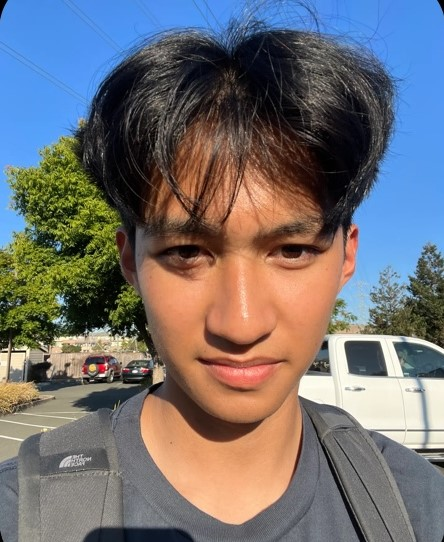

# Personal Page

## About Me

Hello, I am a second year computer science student in Marshall.

## Classes Taken

CSE Classes Taken at UCSD
  - [x] 8A
  - [x] 8B
  - [x] 12
  - [x] 15l
  - [x] 20
  - [x] 21
  - [x] 30
  - [x] 100
  - [x] 101
  - [ ] 105
  - [ ] 110

Most of my experience comes from these classes so I have some familairity with python, Java, C, and C++. My favorite language that I've used is C++. Also, in 15l, I learned how to used Github, and Git. Ever since starting my degree, CSE 110 has been the class I was excited for since I wanted to see how everything we will learn is applied to product making. Since all of these classes have PA's, I have never worked on a group project like in 110, so I'm excited to see how this will go and what I'll learn!

## Where I come from

I come from NorCal in a city called American Canyon located in Napa Valley. Here, I attended American Canyon High School, running cross-country all four years. Some notable thing that are near me are Six Flags Discovery Kingdom, running trails in the wetlands (pretty much waterside), and hiking tails through the rolling valley hills (there are lots of ticks).

## Hobbies

I enjoy going to the gym when I have time. I started last summer, going with friends and have enjoyed it ever since. I also like to spend time messing around with MIDI software. I find it fun to try and make something that sounds good, even though I really have no idea what I'm doing. Finally, I enjoy playing video games. Solo, my go to is Tekken. When with friends, recently I've played a lot of modded Left 4 Dead 2.

## One interesting thing I did

Late last year, I ate a carolina reaper with some friends at a big town event. After a few people were seen throwing up while running around trying to get water, we were kindly asked to leave.
